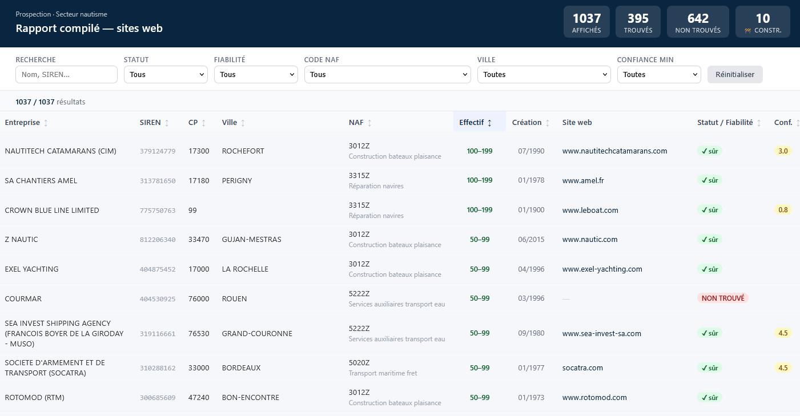

# Prospection SEO — Outil multi-secteur


Outil de prospection commerciale automatisé pour **agences web**. À partir d'un secteur d'activité (nautisme, architectes, restaurants…), il identifie toutes les entreprises françaises du secteur, trouve leurs sites web, et les classe par **opportunité business** : plus le site est absent, ancien ou mal fait, plus l'entreprise est en tête de liste.



---

## Ce que ça fait concrètement

1. **Extrait les entreprises** depuis la base INSEE/SIRENE selon des codes NAF (ex : construction de bateaux, réparation navires…)
2. **Trouve leurs sites web** automatiquement — recherche multi-passes via DuckDuckGo + fallback Google Maps Places
3. **Valide chaque site** : le contenu doit correspondre au secteur (pas de faux positifs)
4. **Qualifie les prospects** par signal commercial : pas de site, site down, site lent, site ancien, pas de blog
5. **Génère deux rapports HTML** filtrables et triables — un rapport global, un rapport santé détaillé

Le tout tourne sans navigateur, sans Selenium, uniquement avec `requests` et l'API `ddgs`.

---

## Résultats typiques

Sur le secteur nautisme (1 037 entreprises) :
- **395 sites trouvés** (validation sectorielle stricte)
- **642 sans site détecté** — signal commercial maximal
- Tri par effectif, date de création, score de confiance

---

## Installation

```bash
git clone https://github.com/Bist0uille/prospection_seo.git
cd prospection_seo
python3 -m venv .venv_wsl
source .venv_wsl/bin/activate
pip install -r requirements.txt
```

---

## Utilisation

### Pipeline complet

```bash
source .venv_wsl/bin/activate

# Par fichier secteur
python Scripts/run_full_pipeline.py --sector Sectors/nautisme.txt

# Par codes NAF directs
python Scripts/run_full_pipeline.py --codes 3012Z,3011Z,3315Z --name nautisme

# Avec filtres
python Scripts/run_full_pipeline.py --sector Sectors/nautisme.txt --limit 50 --min-employees 1
```

| Étape | Script | Description |
|-------|--------|-------------|
| 1 | `prospect_analyzer.py` | Filtre la base INSEE par codes NAF, tranche d'effectifs, statut actif, déduplique par SIREN |
| 2 | `find_websites.py` | Recherche multi-passes avec scoring de confiance et validation sectorielle |
| 3 | `prospect_analyzer.py` | Vérifie chaque site (matching domaine, blocklist, filtre sites non-français) |
| 4 | `seo_auditor.py` | Crawl BFS léger (max 30 pages), extraction signaux SEO business |
| 5 | `prospect_analyzer.py` | Scoring d'opportunité business (1–10), rapport CSV final |

### Rapport compilé HTML

Tableau filtrable de toutes les entreprises du secteur avec leurs sites web.

```bash
python Scripts/generate_compiled_html.py --sector nautisme_na
```

Colonnes : nom, SIREN, CP, ville, NAF, effectif, date de création, site web, statut/fiabilité, score de confiance.

### Rapport santé (site_health_checker.py)

Script standalone — qualifie les sites existants par signal commercial.

```bash
python Scripts/site_health_checker.py \
  --departements 17,33,16,40,47,64 \
  --output Results/nautisme/site_health
```

| Signal | Description |
|--------|-------------|
| `pas_de_site` | Aucun site trouvé — opportunité maximale |
| `down` | Site inaccessible |
| `lent` | Réponse > 3 s |
| `site_ancien` | Copyright > 2 ans |
| `sans_blog` | Site up mais pas de blog |
| `ok` | Pas d'opportunité évidente |

Les sites gérés par une agence reçoivent un **bonus +0.5** (descendent dans leur catégorie — moins urgents).

---

## Recherche de sites (find_websites.py)

Algorithme multi-passes — seuls les sites dont le contenu correspond au secteur sont retenus.

| Passe | Requête |
|-------|---------|
| 0 | URL devinée directement (`{slug}.fr` / `{slug}.com`) |
| 1 | `{alias}` (nom commercial entre parenthèses) |
| 2 | `{nom}` légal nettoyé |
| 3 | `{nom} {commune}` |
| 4 | `{nom} {secteur}` |

**Score de confiance** : keyword du nom dans le domaine (+2.0), TLD `.fr` (+0.5), code postal dans la page (+1.5), commune (+1.0). Seuil d'acceptation : ≥ 2.5 ET `secteur_ok = True`.

### Fallback Google Maps (find_websites_gmaps.py)

Pour les entreprises sans site détecté par DDG, une passe supplémentaire interroge l'**API Google Maps Places (New) v1**.

```bash
export GOOGLE_MAPS_API_KEY="AIza..."   # ou dans .env
python Scripts/find_websites_gmaps.py --min-employees 1
```

Trie par effectif décroissant, valide le contenu du site avant d'accepter le résultat.

---

## Base de données (db_init.py)

Les données sont centralisées dans `DataBase/prospection.db` — base SQLite multi-secteur.

```bash
python Scripts/db_init.py --sector nautisme_na        # migration + fetch dates SIRENE
python Scripts/db_init.py --sector nautisme_na --no-fetch  # sans appel API
python Scripts/db_init.py --stats-only                # statistiques
```

Les dates de création manquantes sont fetched automatiquement depuis l'API `recherche-entreprises.api.gouv.fr`.

| Table | Contenu |
|-------|---------|
| `entreprises` | Données SIRENE — PK `(siren, secteur)` |
| `sites_web` | Sites trouvés, statut, confiance, flags |
| `site_health` | Résultats health checker |
| `seo_audits` | Résultats d'audit SEO |
| `contacts` | Emails et téléphones extraits |

---

## Structure du projet

```
├── Scripts/
│   ├── run_full_pipeline.py      # Point d'entrée — pipeline multi-secteur
│   ├── find_websites.py          # Recherche sites web (DDG, scoring, validation)
│   ├── find_websites_gmaps.py    # Fallback Google Maps Places API
│   ├── fetch_sirene_api.py       # Fetch entreprises depuis l'API SIRENE
│   ├── seo_auditor.py            # Audit SEO par crawl BFS léger
│   ├── prospect_analyzer.py      # Filtrage, vérification, scoring
│   ├── site_health_checker.py    # Health check standalone
│   ├── db_init.py                # Migration CSV → SQLite (prospection.db)
│   ├── generate_compiled_html.py # Rapport HTML filtrable depuis SQLite
│   └── core/                     # Infrastructure partagée
│
├── Sectors/
│   ├── nautisme.txt              # Codes APE secteur nautisme
│   └── template.txt              # Modèle pour un nouveau secteur
│
├── DataBase/
│   └── prospection.db            # Base SQLite multi-secteur (généré par db_init.py)
│
├── Results/
│   └── {secteur}/
│       ├── filtered_companies_websites_compiled.csv  # CSV compilé (corrections manuelles)
│       ├── site_health.csv
│       └── site_health.html
│
└── assets/
    └── rapport_compile.png
```

---

## Ajouter un secteur

1. Créer `Sectors/mon_secteur.txt` avec les codes NAF (un par ligne, `#` pour commenter)
2. Lancer le pipeline : `python Scripts/run_full_pipeline.py --sector Sectors/mon_secteur.txt`
3. Migrer en base : `python Scripts/db_init.py --sector mon_secteur`

---

## Considérations légales

Cet outil utilise des données publiques (base INSEE/SIRENE) et effectue des requêtes HTTP standards. À utiliser dans le respect du RGPD et des conditions d'utilisation des sites visités.
